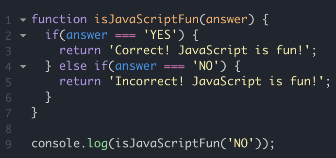

## Old Perspectives

Ever since I started studying Computer Science, I never really knew what exactly I wanted to do when I acquired my BS Degree. The only thing I was sure of was that knowing how to program would be a great skill in the near future and that was a good enough reason for me to pursue my degree in CS. I've learned a lot over time but nothing really seemed to help me decide what I would pursue as my career. But recently I found an interest in web development and it has drastically changed my persepctives about programming.

## New Perspectives
As I found out what I wanted to do professionally, I was given a motivation that I didn't know I needed. I can now say that I am enjoying myself as I learn more about Computer Science, and that enjoyment has confirmed that I had made the right decision in studying Computer Science. To add on, I found my motivation at the perfect time, for at the time I am writing this, I am learning Javascript, a language that is very important within web development. I have gained a new perspective on programming and am sure it will positively impact my learning in the future.

## An Early JavaScript Review
I've only learned a small amount of information about JavaScript, but I am already liking it more than Java, C, and C++. Although the fundamental concepts between the languages that I've learned are relatively similar, I am currently finding JavaScript to be much simpler, and I definitely prefer simple. For example, being able to declare variables without having to declare their datatypes is not only simpler but the code itself just seems much cleaner. I am very glad that JavaScript is often used within web development, for based off the information I have now, it seems to be my favorite programming language thus far.

## Learning through Athletic Software Engineering
I will be learning JavaScript through Athletic Software Engineering which is a "high-intensity and time-constrained method of acquiring competency with software engineering skills" designed by Dr. Philip Johnson at University of Hawaii at Manoa (<a href="http://philipmjohnson.org/essays/ase-2017.html">Athletic Sofware Engineering</a>). Although, Dr. Johnson's ways of teaching seem to be very effective, my only concern is working under a time restriction. Working under pressure is something I do not excel at, but I am hoping to change that while learning JavaScript. I am hoping to not only learn a new programming language, but also life skills, such as working under pressure, while learning through Athletic Software Engineering.
