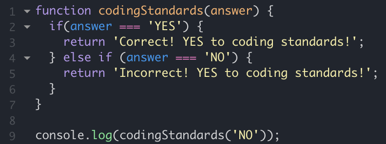

## My Type of Satisfaction
Ever since I was a kid, I've always found satisfation in following a certain structure and would try my best to stick to it at all costs. Even the smallest deviation from a set structure would be a large annoyance to me and would eventually lead to me making changes. Even as I write these essays, I am writing them all using a set layout, with no means of changing it up. If I had no choice but to change the formatting, I would change what I can, so there can at least be a consistency in my work. I find consistency to be extremely satisfying, and luckily, I have been able to utilize this aspect of mine to make many things in life more enjoyable. One of them being coding.

## Finding Satisfaction in Coding
Coding can be fun, but it can also be a huge pain. Unfortunately for me, the more difficult the material that I learn, the less enjoyable coding becomes. However, I have recently been introduced to a new IDE called IntelliJ, as well as a supported coding standard called ESLint, which helps me follow a set structure when I am coding. As I have said before, following a specific format is very satisfying to me and thus makes coding with ESLint much more enjoyable. One of the features of ESLint that seems to be made for me is that it tells the user where spaces should be added/omitted. When coding without a coding standard, I often would add/omit spaces inconsistently which I found to be quite bothersome. Since ESLint tells us of syntactic errors such as incorrect indenting or spacing, I can now write my code in a consistent manner without much effort. 

## Why Coding Standards Are Important
Although I find coding standards to be very important, many other programmers might not think the same. However, I feel that everyone should get used to following coding standards for it could be very useful when working within a company. For example, when working for a company, more than likely, you'll have to share your code to others at a certain point and when you do, I believe that it would be important to be coding in a similar, if not the same, structure for easier distribution and comprehension. Especially, if you are working on a group project and need to combine your code with your teammates at a certain point, it would be much easier to just all follow the same format to speed up the process. If everyone within the same company wrote without a specific coding standard, their work would look messy and unprofessional. Therefore, coding standards are much more important than some people might think and if you're currently reading this and not following a coding standard, change that right now!

## Say YES to Coding Standards
For the above reasons, I am finding coding standards to be a necessity when I am coding, for it makes it not only more organized, but more enjoyable as well. From now to the end of my career, coding standards will most definitely be a huge aspect within my work and for most programmers, so if someone ever asks you if you want to use a coding standard, say "YES"!
