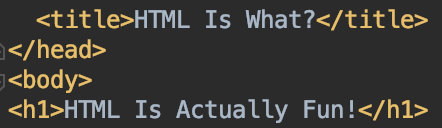

## Early Experiences with HTML
I'll be honest, I never thought I'd reach this point ever since I decided to study Computer Science. I expected the journey in getting my BS Degree to be filled with sleepless nights and eternal sorrow. I can still hear the laughs that came out of my mouth as I saw my program fail for the millionth time in a row. The sound of my fingers tapping the keyboard is forever engraved in my head. 

Now you're probably wondering, "What point did he exactly reach?" This might sound crazy, but I'm actually enjoying what I am currently learning right now. Yes, I said it. I am currently thorougly enjoying being a CS Major. The reason for my enjoyment is because I have recently been introduced to HTML. Compared to any other programming language that I have learned, HTML is actually fun to experiment with and much easier, at least to me, to troubleshoot problems. I also really like the fact that the majority of the commands within HTML are rather straightforward, so I hardly ever have to worry about searching up what a certain command does. The simple but efficient nature of HTML is what has made me such a big fan of the programming language.

To top it all off, I was actually planning on building and designing websites in the future, so I am very fortunate that HTML is quite enjoyable.

## Why Semantic UI?
A little after I started learning HTML, I was introduced to a UI Framework called Semantic UI. Semantic UI is a framework that consists of various user-interface commands. At first, I did not see what the point of using Semantic UI over raw HTML was, because I felt that every time I used Semantic UI, I also could've done with raw HTML. However, as I kept working with Semantic UI, I realized why we were being forced to learn it.

## Oh, That's Why
As I got more comfortable with Semantic UI, the rate at which I was finishing building websites was drastically increasing. Semantic UI is much more efficient when building complex websites, and knowing that I'll have to build more and more complex websites in the future, familiarizing myself with UI Frameworks such as Semantic UI is definitely important.

Although I am still new to UI Frameworks, I know that they will be a huge factor in helping me build top-quality websites, which is why I will force myself to use them over raw HTML.
