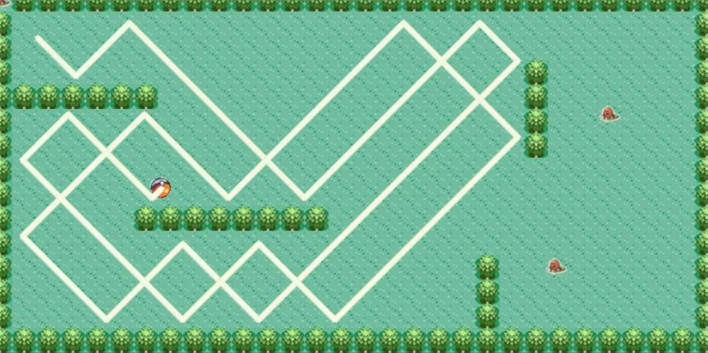

I replicated the mechanics of a roomba vacuum cleaner for a project in my ICS 111 class at the University of Hawai'i at Manoa. For those of you who do not know, a roomba is a robotic vacuum cleaner that moves in a straight line until it hits an object/wall, where it then "bounces" into a different direction. The goal of the project is for the roomba to collect all the dust and then display an end screen when finished. I, however, based my project off Pokemon, where the roomba is a pokeball, and the dust particles to be collected are pokemon. 

First, a text file will be scanned which will contain all the walls and pokemon(Diglett) to be collected. The pokeball will move diagonally around the map, bounce off the wall, and also leave a trail. Once all the Digletts are collected, the Hall of Fame screen will play.

Within the project, there were two key mechanics that established the foundation of my project.

The first is the mechanics for the movement of the pokeball. Unfortunately, the code for the mechanics of the pokeball movement is quite lengthy so will not be showing it.

The second is to make the Diglett disappear when the pokeball touches it. First, it gets the position of the pokeball and then iterates through a for loop to check if the pokeball is touching the Diglett, and if it is, it will move the Diglett to a position where it can no longer be seen.

This is the code to check if the Diglett has been touched:
```js
public static void isDiglettCaught(EZImage pokeBall) { // function for when pokeball touches diglett
		int xCoord = pokeBall.getXCenter();
		int yCoord = pokeBall.getYCenter();
		for(int i = 0; i < 7; i++) {
			if(digletts[i].isPointInElement(xCoord, yCoord)) {
				digletts[i].translateTo(0,0);
				diglettCaught.play();
			}

		}
	}

```

Another important mechanic is to play the Hall of Fame screen when all the Digletts are caught. First it gets the position of the pokeball and then checks if the final Diglett is touched by the pokeball. When the final Diglett is caught, it will show the Hall of Fame screen and also play the victory music via EZ Graphics.

This is the code to play the end screen:
```js
public static void endGame(EZImage pokeBall) { // function for when last diglett is touched
		int xCoord = pokeBall.getXCenter();
		int yCoord = pokeBall.getYCenter();
		if(digletts[7].isPointInElement(xCoord, yCoord)) {
			digletts[7].translateTo(0,0);
			EZImage hallOfFame = EZ.addImage("halloffame.png", 465, 250);
			bgm.stop();
			allDiglettCaught.play();
			m++;
		}
	}

```
A video of my project in action can be seen <a href="https://www.youtube.com/watch?v=gKN1nsJKSAk">here</a>.

The game was created using Java and <a href="http://www2.hawaii.edu/~dylank/ics111/">EZ Graphics</a>, which is a "multimedia library designed to make it easier for novice programmers to quickly build Java applications that incorporate graphics and sound". 

In this project I gained experience with array lists, file reading/parsing, file writing, 2D arrays, and private/public member variables/functions all within the scope of Java. 
