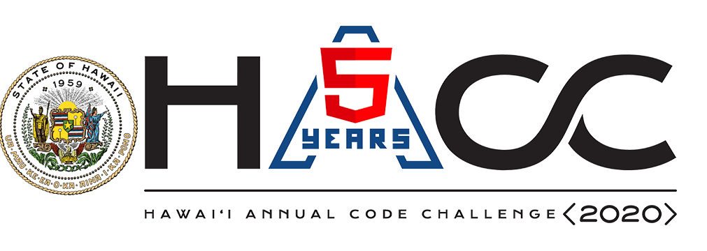

The Hawaii Annual Coding Challenge (HACC), which was created by Gov. David Ige in 2015, is a hackathon that encouraged modernizing state functions and services in order to create a more effective and efficient government. Since HACC is a multi-week competition, prolonged interaction between participating teams provides an opportunity to create sustainable solutions. More information about HACC can be found <a href="https://hacc.hawaii.gov/">here</a>. I was a part of Team HACCSgiving along with Graham Francisco, Calvan Liang, Kegan Flagg, and Chris Na, and decided to tackle the challenge provided by First Lady Dawn Amano-Ige, which was titled Connections: Hawai'i State Resource Directory.

For this challenge, we were tasked to create an app that could provide various programs and services from statewide government agencies and nonprofit agencies in a user-friendly “one-stop-shop" directory, making it easier for those needing support services and referrals. The app we created is called Helping Hands, which attempts to hold the user's hand and provide the relevant resources so that they can keep up-to-date with their current concerns. A demonstration of our app is shown below:

<iframe width="690" height="445" src="https://www.youtube.com/embed/pmVGrtbvdLk" frameborder="0" allow="accelerometer; autoplay; clipboard-write; encrypted-media; gyroscope; picture-in-picture" allowfullscreen></iframe>
