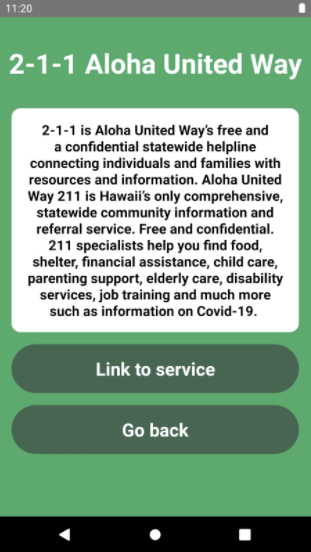
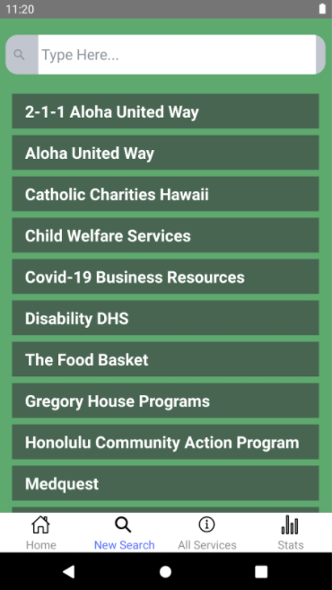

The Hawaii Annual Coding Challenge (HACC), which was created by Gov. David Ige in 2015, is a hackathon that encouraged modernizing state functions and services in order to create a more effective and efficient government. Since HACC is a multi-week competition, prolonged interaction between participating teams provides an opportunity to create sustainable solutions. More information about HACC can be found <a href="https://hacc.hawaii.gov/">here</a>. I was a part of **Team HACCSgiving** along with <a href="https://github.com/gbfrancisco">Graham Francisco</a>, <a href="https://github.com/calvan-liang">Calvan Liang</a>, <a href="https://github.com/LukewarmCoffee">Kegan Flagg</a>, and <a href="https://github.com/chrisjna">Chris Na</a>, and decided to tackle the challenge provided by First Lady Dawn Amano-Ige, which was titled Connections: Hawai'i State Resource Directory. Further information about the challenge can be found <a href="https://hacc.hawaii.gov/wp-content/uploads/2020/10/Challenge_2020_ResourceDirectory.pdf">here</a>.

For this challenge, we were tasked to create an app that could provide various programs and services from statewide government agencies and nonprofit agencies in a user-friendly “one-stop-shop" directory, making it easier for those needing support services and referrals. The app we created is called **Helping Hands**, which attempts to hold the user's hand and provide the relevant resources so that they can keep up-to-date with their current concerns. Before breaking down the core features of our app, a demonstration of our app is shown below to help users understand what Helping Hands is all about.

<iframe width="690" height="445" src="https://www.youtube.com/embed/pmVGrtbvdLk" frameborder="0" allow="accelerometer; autoplay; clipboard-write; encrypted-media; gyroscope; picture-in-picture" allowfullscreen></iframe>

Rather than clicking through multiple links, on Google for example, and getting bombarded by heaps of irrelevant information on each website, we knew that it would not only be a complete time-saver, but also reduce the stress of our users by avoiding this common theme throughout search engines. Although it is possible for agencies to set up a summary of their service under corresponding search results, they are either too short to understand the purpose of their program or sometimes cut off, which forces the user to enter the site. We found that the best way to combat this was to create Cards for each program that provides a reasonable summary of the service, giving users an opportunity to visit the site if they think it's what they are looking for, or they can easily return to the list of services. An example of a Service Card is shown below.

  

Especially during a pandemic, we understood the importance of speed when it comes to relaying information, because a lack of information could result in very dire consequences. Helping Hands is meant to be simple enough for the average user, but incorporate creative and innovative aspects so that we don't fall behind competitors. As the list of services increase, scrolling through endless pages will be too time-consuming, which is why we also included a Search function, to narrow the results and consequently help users find the help they need as quick as possible. The New Search page is shown below, which shows all the available services on the app, but will filter accordingly as the user begins to type in the search bar.

  

Helping Hands was built entirely with React Native and Firebase, which are some of the most popular frameworks and backend services for mobile applications, respectively. The entire team was relatively new to both

One of the biggest challenges during HACC occurred around the middle of the event, where my computer suddenly shut off while working. Although I was not able to commit any of my work to GitHub before it shutdown, I was not too worried because my work should've automatically saved. However, my computer would not turn back on, and unfortunately has still not turned back on to the day that this is being written. On top of the stress from school and personal matters, this event made me unmotivated to move forward, but after some time had passed, I was able to bring

Despite social distancing restrictions, our team was able to work quite well together thanks to Discord. There were a few times where we had to spend all night in the voice chat trying to get everything to work, we were satisfied with our final product and even thought that we might be able to finish in the Top 3. Although we did not place as high as we wanted, we were all able to improve not only our skillset, from Firebase to React Native, but also our abilities to work in team settings.

Sources:
 - <a href="https://github.com/HACC2020/HACCsgiving">GitHub</a>
 - <a href="https://devpost.com/software/helping-hands-o96srp">DevPost</a>
