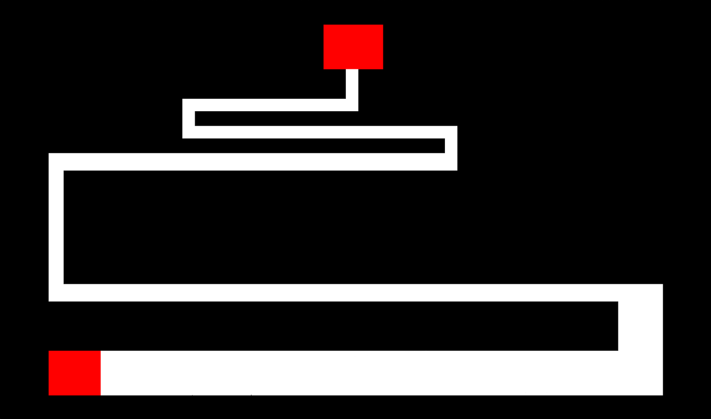

I recreated and added my own little twist to the Scary Maze Game in my ICS 111 class at the University of Hawai'i at Manoa. For those of you who do not know, the Scary Maze Game is a maze game where the user needs to navigate the cursor from one point to another without touching the walls. There are a few levels, each one harder than the previous, but what makes the game "scary" is that the user does not know that when the cursor touches the wall, a scary image will fill the entire screen and also play a loud sound in an attempt to scare the user, which is known as a jumpscare. My version of the game has moving obstacles which make the cursor grow bigger, making it harder to navigate throughout the maze.

Within the project, there were two key core mechanics that established the foundation for the game.
The first is the mechanics for the mouse/cursor, which was easily done with EZ Graphics.

This is the code for the mouse mechanics:
```js
static void mouseMechanics() {
		// Get the mouseʻs X and Y position
		clickX = EZInteraction.getXMouse();
		clickY = EZInteraction.getYMouse();
		// move the picture of my cursor to the position of clickX, clickY
		cursor.translateTo(clickX, clickY);
	}
```

The other key mechanic within the game was to show the scary image and play the loud sound when the cursor touched the wall.
Since I had to create multiple walls, I iterated through each wall's position to check if the cursor was touching a wall when the function was called. If it was touched, it would add the image and play the sound via EZ Graphics.

This is the code for if the wall was touched:
```js
static void isWallTouched() {
		// if wall is touched by cursor, show scary image
		for(int i = 0; i < 15; i++) {
			if(walls[i].isPointInElement(clickX, clickY)) {
				EZ.addImage("scarypopup.png", 700, 430);
				EZ.addSound("scream.wav");
			}
		}
	}
}
```

The game was created using Java and <a href="http://www2.hawaii.edu/~dylank/ics111/">EZ Graphics</a>, which is a "multimedia library designed to make it easier for novice programmers to quickly build Java applications that incorporate graphics and sound". 

In this project I gained experience with array lists, file reading/parsing, file writing, 2D arrays, inheritance, and private/public member variables/functions all within the scope of Java.
 
